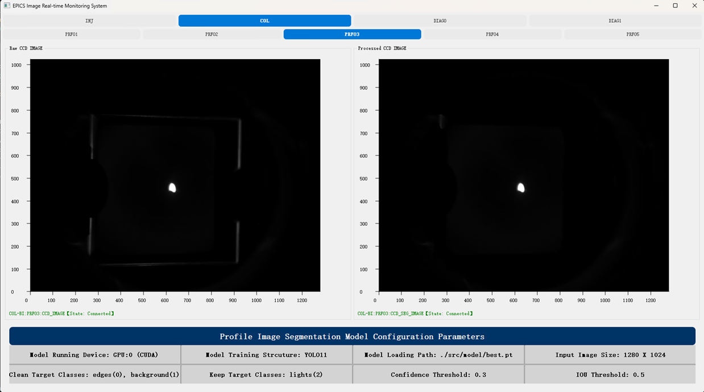
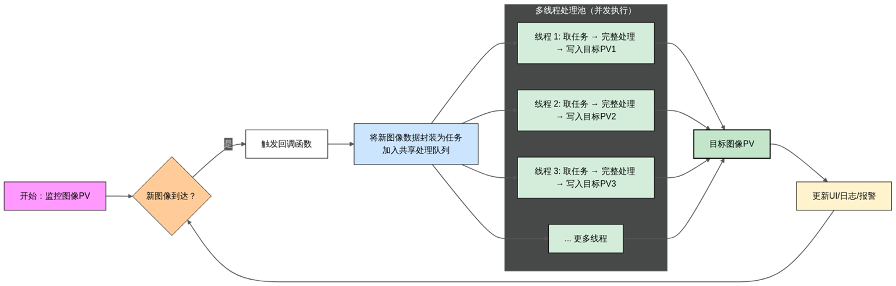

# Epics_Profile_Image_Denosier

[](https://github.com/Palette25/Epics_Profile_Image_Denoiser/blob/master/LICENSE)


## 电子束图像分割去噪软件

> Contributers: Palette25

> Institution: IASF, ShenZhen

### 主要功能:
1. 结合YOLO11实例分割模型，将电子束中非关注的靶边缘成像区域进行去除。
2. 对电子束Profile图像进行背景去噪，优化视觉图像的整体效果，有助于调束人员进行清晰可辨的束流诊断。
3. 提供可视化界面，进行图像处理前后的实时对比。

 </img>

### 改进：
1. 持续优化图像实例分割模型效果，通过真实场景下的采集图像与标注优化模型分割的准确率指标。
2. 在多PV场景下加入多线程处理逻辑，同时对不同PV图像进行监控和实时处理。

 </img>

### 使用方式：
0. 使用前，首先安装Python+Pytorch运行环境，在`yolo`环境名下把依赖的库都完成安装：
    ```python
    # 创建conda环境
    conda create -n yolo python=3.8
    # 安装所需的所有依赖
    pip install -r requirements.txt
    ```
1. 启动多线程服务，同时监控多个原始图像PV：
    ```python
    # 支持自动切换conda环境，可在任意环境下直接运行
    ./run_service.bat
    ```
2. 启动可视化界面，实时监控处理结果：
    ```python
    # 支持自动切换conda环境，可在任意环境下直接运行
    ./run_vis.bat
    ```

3. (本地测试用)提供本地自定义PV的启动：
    ```python
    ./run_local_server.bat
    ```

### 优势：
1. 将运行操作完全写成批处理文件，方便用户快捷运行，同时支持自定义批处理文件内容修改
2. 对不同模块的封装较为完善，基本按照功能分类进行模块划分

### Todo List:
1. 在Linux系统上，推出支持Shell环境运行的一键式脚本
2. 持续优化模型与服务

### 数据集存放地址：(Teambition文件夹存放)
1. https://www.teambition.com/project/60222575f38ec6065a9535ab/works/695e3d10681448f1db1c69c8